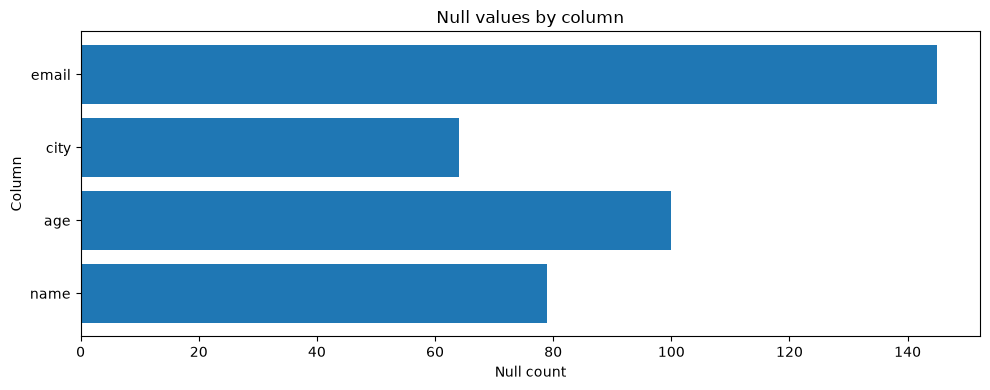

# Data Quality Report

Input file: `data/sample/customers_large_dirty.csv`

## Summary

- Overall status: **failed**
- Quality score: **50.0%**
- Total checks: 2
- Passed checks: 1
- Failed checks: 1

## Dataset profile

- Rows: 20008
- Columns: 9

## Null counts

| Column | Null count |
|---|---:|

## Insights

- Dataset contains 20008 rows and 9 columns.
- Overall quality score is 50.0%.
- 1 validation check(s) failed.
- Check 'not_null_columns' failed.
- Column 'name' contains 79 null value(s).
- Column 'email' contains 145 null value(s).

## AI Summary

### Dataset quality summary

The dataset failed 1 validation check(s). Failed checks: not_null_columns. These issues should be reviewed before using the dataset in production analytics.

### Recommendations

- Review failed validation checks.
- Investigate affected columns in the source data.
- Consider adding stricter checks to the ingestion pipeline.

| id | 0 |
| name | 79 |
| age | 100 |
| city | 64 |
| email | 145 |
| signup_date | 0 |
| customer_segment | 0 |
| monthly_spend | 0 |
| is_active | 0 |

## Null counts chart

## Validation results

| Check | Status | Details |
|---|---|---|
| required_columns | passed ✅ |  |
| not_null_columns | failed ❌ | name (79 nulls), email (145 nulls) |